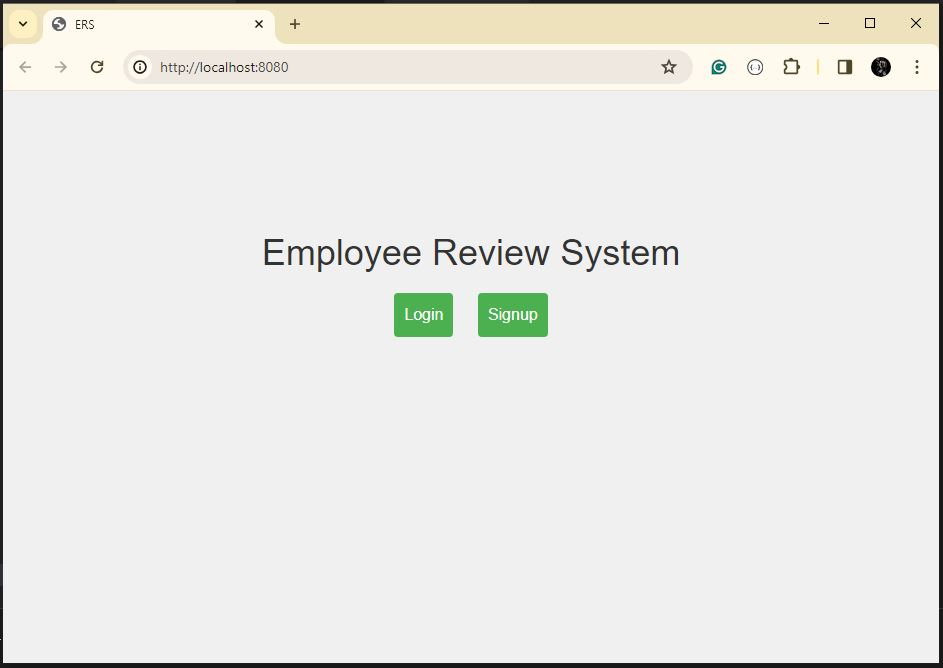
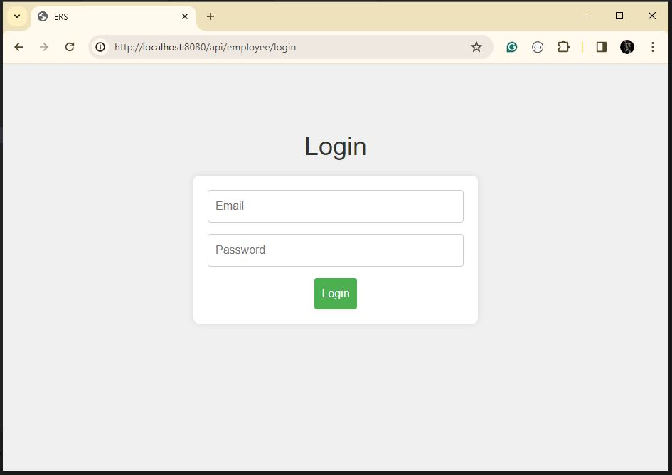
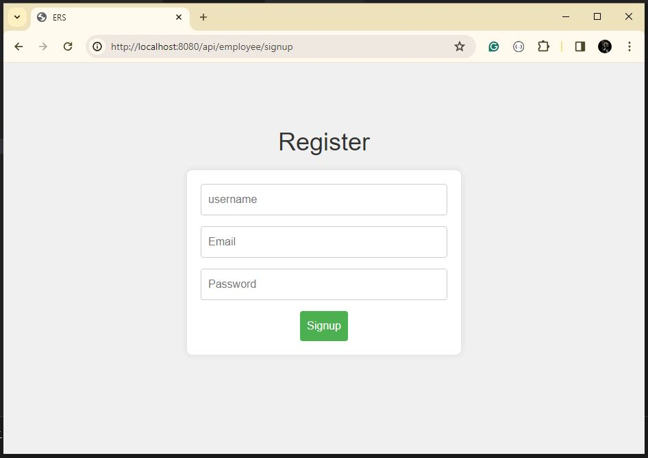

# Employee-Review-System
Application that allows employees to submit feedback toward each other’s performance

### Folder Structure 

### Front-End
#### Home Page

#### login Page

#### signup Page

### Back-End

#### Database Model

1. Employee Model
    - employeeName
    - email
    - password
    - role ['admin', 'employee']
2. Performance Riview Model
    - title
    - feedback
    = participants

### API End Points

#### Admin 

#### Employee