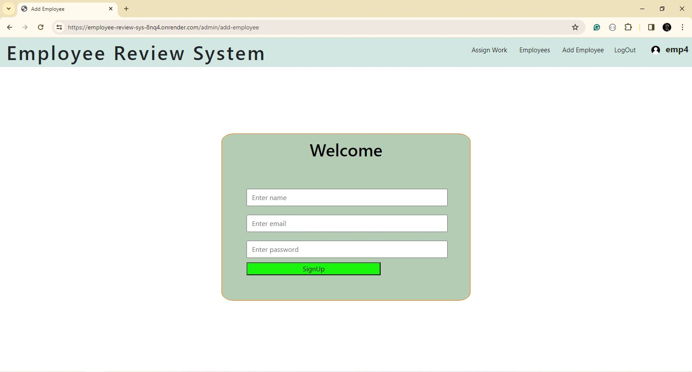

# Employee-Review-System
Application that allows employees to submit feedback toward each other’s performance

### Description

A full stack app, in which the admin, can assign the employees, to review each other on the basic of there work. The admin has special power, to make any other employee
as the new admin. Admin can also make the new employee, and they can also assing, the reviewer and revieweee. The admin can see the current employee, and according to the
review, the admin can remove the employee. The review given to the employee, is always going to be store in the database.

### Folder Structure 

### Front-End
#### SignUp Page

#### Login Page

### Back-End

#### Database Model

1. Employee Model
    - employeeName
    - email
    - password
    - role ['admin', 'employee']
2. Performance Riview Model
    - title
    - feedback
    - participant

### API End Points

#### Admin 

#### Employee